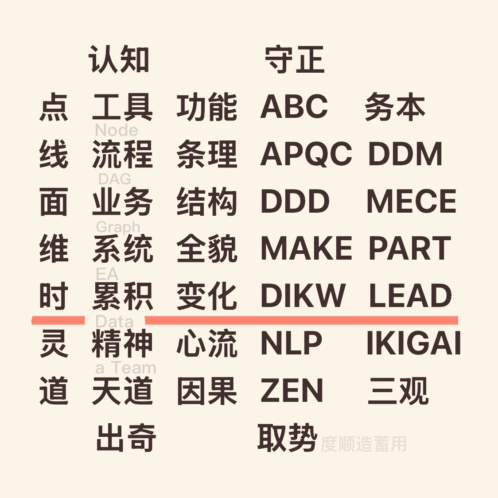

# ai-zen
Progressive Framework for Agentic EA

# ollama 4 brew
<pre>
export HOMEBREW_NO_AUTO_UPDATE=0
brew upgrade ollama
brew services restart ollama
ollama -v
ollama version is 0.13.5
  
vi homebrew.mxcl.ollama.plist
    <key>OLLAMA_FLASH_ATTENTION</key>
    <string>1</string>
    <key>OLLAMA_KV_CACHE_TYPE</key>
    <string>q8_0</string>
    <key>OLLAMA_NUM_PARALLEL</key>
    <string>16</string>
    <key>OLLAMA_MAX_LOADED_MODELS</key>
    <string>8</string>
    <key>OLLAMA_MAX_QUEUE</key>
    <string>512</string>
    <key>OLLAMA_KEEP_ALIVE</key>
    <string>72h</string>
    <key>OLLAMA_NUM_THREADS</key>
    <string>16</string>
    <key>OLLAMA_CONTEXT_LENGTH</key>
    <string>20480</string>
    <key>OLLAMA_HOST</key>
    <string>0.0.0.0:11434</string>

#配置检查
plutil ./homebrew.mxcl.ollama.plist
diff ./homebrew.mxcl.ollama.plist  ~/Library/LaunchAgents/homebrew.mxcl.ollama.plist
cp ./homebrew.mxcl.ollama.plist  ~/Library/LaunchAgents/homebrew.mxcl.ollama.plist

#重载服务（不要用 brew services restart，否则可能覆盖环境变量）：
launchctl unload ~/Library/LaunchAgents/homebrew.mxcl.ollama.plist
launchctl load ~/Library/LaunchAgents/homebrew.mxcl.ollama.plist

#检查生效
lsof -iTCP:11434 -sTCP:LISTEN
ps eww $(pgrep ollama) | grep OLLAMA  
</pre>

# qwen3 /no_think
ollama create qwen3n -f qwen3n.Modelfile

