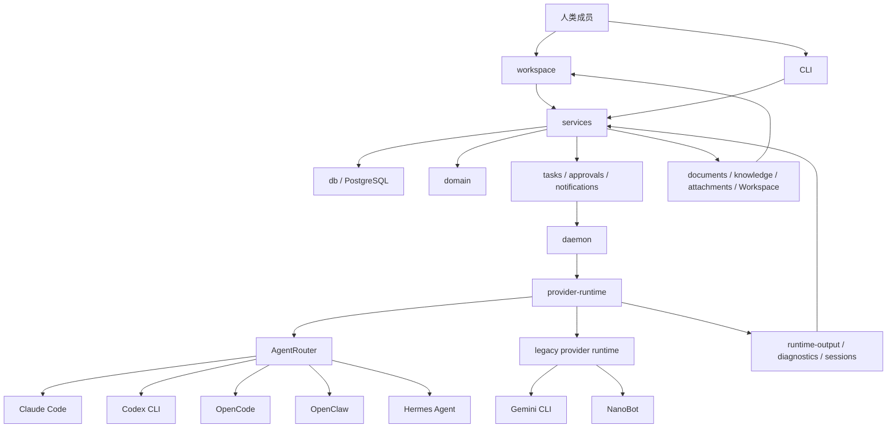

<h1 align="center">vRPC：人类 + Agent。一个团队。一个工作空间</h1>

  <strong>vRPC 让人类和 Agent 在同一个工作空间里组成同一个团队</strong> 
  <strong>vRPC 为人类和 Agent 共同协作而生。</strong>

---

面向 **人类 + Agent 团队** 的 agent-native 协作工作空间。

Agent 不只是被调用的工具，而是可以一起工作、被管理、被信任的一线队友。

**今天 Agent 的问题：**

真实工作不会孤立发生，它发生在**人、系统和责任边界**之间。但大多数 Agent framework 仍然围绕个人使用设计，不适合**团队**，不适合**组织**，也不适合**规模化**。

**为这些场景而建：**

- 🧑‍💼 有明确岗位、owner 和责任边界的 Agent
- 🤝 人类和 Agent 在共享 workspace pipeline 中协作
- 🔐 敏感动作由权限、审批和审计轨迹治理
- 🔄 Agent 可以在组织内被招募、转移和审计

 帮助团队在保持可控的前提下快速推进工作、明确责任，并持续扩展。

它把真实 workplace pipeline的组织结构带入 human + agent collaboration。

---

## 核心功能

**团队可以用 vRPC 做什么：**

- 🗂 **招募和分配 Agent** — 创建有明确角色和 owner 的专用 Agent 
- 🤝 **协调多 Agent 工作流** — Agent 在共享 workspace pipeline 内协作 
- 📅 **调度 Agent 工作** — 自动安排 Agent 何时、如何执行任务 
- 🔐 **执行权限和审批** — 将敏感动作限制在治理边界内 
- 📋 **审计所有过程** — 完整查看 Agent 的动作、决策和输出 
- 🔄 **共享和转移 Agent** — 让数字员工跨团队、跨部门流转

---

## 当前 Agent 工作流的问题

Agent 越来越强，但团队使用 Agent 的方式还没有跟上。

大多数 Agent 产品仍然为个人使用而建：一个人、一个终端、一个聊天会话。真实团队一旦把 Agent 放进日常运营，问题就会出现：

- **Agent 仍是个人工具** — 强大的 Agent 留在某个人的终端或账号里，对团队不可见。
- **上下文分散** — 消息、文档、审批、截图和 runtime 文件没有共享归宿。
- **执行路径割裂** — 每个 provider 都有自己的 CLI 行为、session 模型和诊断方式；切换 runtime 等于重建上下文。
- **治理缺失** — 凭据、文档、runtime access、工具调用和外发动作很难集中检查。
- **工作难以持续** — 跨天任务需要队列、交接、产物、重试和人类检查点，而单一 Agent framework 很难覆盖。

结果是：Agent 在个人场景里很强，在团队场景里却很弱。

**vRPC 为改变这一点而建。** 人类负责**方向和授权**，Agent 负责**协调和执行**。

---

## vRPC是什么？

**这是人类团队和数字员工在同一个组织上下文中工作的操作型 workspace。**

vRPC 为 Agent 组织提供四个关键能力：调度、能力共享、多 Agent 协作和治理，让 Agent 终于可以像真实团队一样工作。

---

### 🗓 调度 — 同一个 Agent，选择最合适的 runtime

同一个 Agent 不应该因为执行需求变化就被重新创建。

- 保持 Agent 身份、instructions 和上下文在任务间稳定。
- 通过 AgentRouter 将每个任务路由到合适的 harness 或 provider runtime：Claude Code、Codex、OpenClaw、Hermes 等。
- 统一不同 runtime 的事件、session、产物和诊断。
- 执行路径变化时，只改变 harness；技能、知识、权限和完整员工上下文都保持不变。

---

### 🧑‍💼 能力 — 把私人 Agent 变成共享组织资产

一个优秀 Agent 如果锁在某个人的账号里，就是被浪费的组织潜力。

- 在全组织展示每个数字员工的岗位、owner、技能、知识、ready 状态和 runtime binding。
- 让团队成员申请访问、借用 Agent、调用 channel-ready 员工，而不是从零开始。
- owner review queue 和管理员审批路径保持显式；人类对访问边界保留 100% 控制权。
- 让优秀 Agent 被看见，同时不放弃控制。

---

### 🤝 协作 — Agent 协调推进，人类审批关键节点

真实工作流经人、系统和决策，而不只是一个聊天框。

- Agent 使用频道、直接会话、inbox 任务、文档和任务看板工作。
- 复杂请求可以经过证据整理、预算检查、审批准备、执行和产物交付，而不需要人类手动交接。
- runtime output 文件、执行事件和任务历史保留在 workspace 里，而不是埋在某个人的终端里。
- 高影响动作直接进入人类审批，并配合快速的 TabTabTab 风格审批循环，让 Agent 能继续推进，同时让人类保持控制。

---

### 🔐 安全 — 每个动作都有边界、记录和 owner

随着 Agent 承担更多执行工作，治理不能事后补上。

- 从一个地方治理 workspace role、频道、文档、技能、知识、runtime、daemon token 和 credential。
- 支持文档权限请求、runtime tool approval、knowledge proposal review 和 agent-scoped Workspace delegation。
- 可以按资源树或 actor 反查权限。
- 在一个控制面内撤销、审计和诊断权限漂移，避免问题扩大。

---

## 差异对比

| 没有 vRPC | 使用 vRPC |
| --- | --- |
| Agent 是藏在本地终端或私聊里的个人工具。 | Agent 成为有身份、owner、技能、知识和申请流程的数字员工。 |
| 每个 runtime 都有自己的执行路径、session 模型和诊断方式。 | AgentRouter 把所有 harness 归一到统一执行 contract 后面。 |
| 人类手动在聊天、文档、表格和任务之间搬运上下文。 | 共享 workspace 让人类和 Agent 拥有同一个操作上下文。 |
| 权限散落在工具、文件、凭据和外部账号里。 | 一个控制面集中管理授权、审批、委托和审计轨迹。 |
| 工作最终停留在对话记录里。 | 工作沉淀为任务、文件、文档、runtime output、审批和可追踪历史。 |

---

## vRPC 实战演示

分别对应四个核心能力。
| 能力 | 你会看到什么 |
| --- | --- |
| 🗓 **调度** | AgentRouter 让同一个 Agent 跨多个 runtime 执行，身份、上下文和技能始终保持稳定。 |
| 🧑‍💼 **能力** | 数字员工展板让私人 Agent 对全组织可见、可借用、可复用。 |
| 🤝 **协作** | 多个 Agent 协调推进一个高风险运营决策，并通过人类审批节点继续向前。 |
| 🔐 **安全** | 权限、授权、凭据、文档和外发动作全部可见、可审计，并由人类控制。 |

---

## 使用场景：创始团队执行系统

小团队需要速度，但**没有控制**的速度会制造债务。vRPC 让创始团队获得接近更大组织的**执行杠杆**，同时不失去对实际工作流的**可见性和责任边界**。

**典型流程如下：**

1. **创始人在 workspace 频道里提出请求** — 不需要额外 ticket 系统，也没有启动成本。
2. **协调型 Agent 自动拆解** — 任务被拆分、界定范围，并分配给合适的专业 Agent。
3. **Agent 收集所需上下文** — 文档、知识页、Workspace 文件和历史执行产物都会进入上下文。
4. **高风险动作会在发生前被标记** — 工具调用、文档访问、外发动作和预算敏感动作会进入人类审批节点。
5. **人类批准或拒绝** — 一次决策，完整可见，不需要微观管理。
6. **Agent 完成工作** — 结果写回任务、文档、附件和 runtime output，不会丢失。

目标不是更聪明的聊天机器人，而是一个受治理的操作界面，让人类和 Agent 一起完成真实工作，并让每个动作都可见、可控、可追踪。

---

## Framework

### 数字员工Kanban

Kanban把 Agent 暴露为可管理的组织资源：

- 角色、摘要、owner、ready 状态和运行状态
- 已分配技能和知识
- runtime 与 harness binding
- 共同频道和频道可用性
- 借用/request flows
- owner 和 admin 的 review queues

### 权限控制面

权限模型围绕资源、actor、grant source、执行能力和外部 delegation 组织。

| 控制面 | 能力 |
| --- | --- |
| Workspace 成员 | owner/admin/member 角色、邀请链接、join codes、邀请历史 |
| 频道访问 | 加入、频道邀请、访问请求、读写断言 |
| 直接会话隐私 | 直接会话仅限参与者和相关 agent owner |
| Agent 管理 | owner、instructions、频道可用性、技能、知识、runtime binding |
| Runtime 授权 | user-level grants、runtime sharing、bind/unbind、runtime provider health |
| Daemon 安全 | API token 创建/撤销、远程 daemon 注册、runtime display name |
| 文档 | owner/editor/viewer 角色、agent access、permission requests、version rollback |
| Workspace | OAuth credential owner、agent-scoped delegation、external document requests |
| 审批 | runtime tool approvals、knowledge proposal approvals、document permissions |
| 诊断 | missing grants、revoked credentials、orphaned grants、unavailable providers |

### 技能、知识和 Workspace

vRPC 包含可复用的执行构件：

- file-backed workspace skills，可创建、导入、导出并分配给 Agent
- knowledge pages、materials、attachments、channel docs 和 generated knowledge proposals
- Sheets 和 Docs 创建或链接
- 面向 Agent 的 scoped Workspace delegation
- 缺少访问权限时的 permission request flows

---

## 路线图

- 多租户工作空间、工作空间成员体系和访问控制
- PostgreSQL 主存储、附件和可靠通知
- 频道文档、知识库、全局搜索、审批、任务看板、预算、成本和性能仪表盘
- 远程 daemon、runtime sharing、AgentRouter harness switching、OpenClaw provider health 和 Hermes Agent support
- agent-scoped Workspace OAuth、Sheets 创建/回写、runtime output CLI 和 permission center
- 更强的 AgentRouter 平台会话
- 更深入的 OpenClaw provider 加固
- 多 Agent 隔离和 sandbox policy layer
- 更完整的 integration adapter contract
- runtime tool marketplace 和更多 agent-native app harnesses
- 更严格的 attachment signed URL 与 storage isolation 策略
